# Google Cloud Landing Zone Architecture - Banking Group

*Version: 1.0*
*Date: May 21, 2025*

## Table of Contents

1. [Introduction](#1-introduction)
2. [Guiding Principles & Compliance](#2-guiding-principles--compliance)
3. [Google Cloud Organization and Resource Hierarchy](#3-google-cloud-organization-and-resource-hierarchy)
4. [Identity and Access Management (IAM)](#4-identity-and-access-management-iam)
5. [Networking and Connectivity](#5-networking-and-connectivity)
   - [5.1 Network Topology](#51-network-topology)
   - [5.2 IP Addressing & BGP](#52-ip-addressing--bgp)
   - [5.3 Internet Egress](#53-internet-egress)
   - [5.4 Access to Google APIs](#54-access-to-google-apis)
   - [5.5 Firewall Architecture](#55-firewall-architecture)
   - [5.6 DNS Architecture](#56-dns-architecture)
6. [Security and Compliance Controls](#6-security-and-compliance-controls)
7. [AI/ML & Data-Analytics Platform Architecture](#7-aiml--data-analytics-platform-architecture)
8. [Hybrid & Multi-Cloud Integration](#8-hybrid--multi-cloud-integration)
9. [Operations & Observability](#9-operations--observability)
10. [Infrastructure as Code (IaC) & Automation](#10-infrastructure-as-code-iac--automation)
11. [Terraform Strategy](#11-terraform-strategy)


---

## 1. Introduction

This document details the Google Cloud Landing Zone Architecture for the Banking Group, providing a secure, compliant, scalable, and automated foundation for AI/ML and data-analytics workloads within a hybrid cloud context.

The architecture implements a policy-driven approach using Infrastructure as Code (IaC) with Terraform to ensure repeatable and consistent deployments.

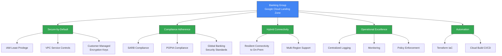

---

## 2. Guiding Principles & Compliance

The architecture is founded on key principles and compliance requirements to ensure a secure and compliant cloud environment for banking operations.

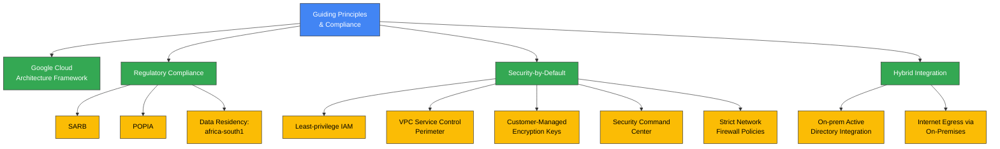

---

## 3. Google Cloud Organization and Resource Hierarchy

The resource hierarchy provides structure for governance, cost management, and operational efficiency.

```mermaid
graph TD
    ORG[Organization: bank.example] --> FOLDER_SHARED[Folder: 00-Shared-Services]
    ORG --> FOLDER_PROD[Folder: 10-Prod-Environments]
    ORG --> FOLDER_NONPROD[Folder: 20-Non-Prod-Environments]
    ORG --> FOLDER_SANDBOX[Folder: 30-Sandbox-Environments]
    
    FOLDER_SHARED --> PRJ_TRANSIT[Project: Transit-Connectivity]
    FOLDER_SHARED --> PRJ_VPC_ZA[Project: Shared-VPC-Host-ZA]
    FOLDER_SHARED --> PRJ_VPC_LON[Project: Shared-VPC-Host-LON]
    FOLDER_SHARED --> PRJ_SEC[Project: Security-Tools]
    FOLDER_SHARED --> PRJ_LOG[Project: Logging]
    FOLDER_SHARED --> PRJ_MON[Project: Monitoring]
    
    FOLDER_PROD --> BU_RETAIL_PROD[Folder: bu-retail-prod]
    BU_RETAIL_PROD --> PROJ_RETAIL_PROD[Project: Workload-Retail-Prod]
    
    FOLDER_NONPROD --> BU_RETAIL_DEV[Folder: bu-retail-dev]
    BU_RETAIL_DEV --> PROJ_RETAIL_DEV[Project: Workload-Retail-Dev]
    
    FOLDER_NONPROD --> BU_RETAIL_UAT[Folder: bu-retail-uat]
    BU_RETAIL_UAT --> PROJ_RETAIL_UAT[Project: Workload-Retail-UAT]
    
    FOLDER_SANDBOX --> PROJ_SANDBOX[Project: Sandbox-Projects]
    
    classDef org fill:#4285F4,stroke:#333,stroke-width:1px,color:white;
    classDef folder fill:#34A853,stroke:#333,stroke-width:1px,color:white;
    classDef project fill:#FBBC05,stroke:#333,stroke-width:1px,color:black;
    class ORG org;
    class FOLDER_SHARED,FOLDER_PROD,FOLDER_NONPROD,FOLDER_SANDBOX,BU_RETAIL_PROD,BU_RETAIL_DEV,BU_RETAIL_UAT folder;
    class PRJ_TRANSIT,PRJ_VPC_ZA,PRJ_VPC_LON,PRJ_SEC,PRJ_LOG,PRJ_MON,PROJ_RETAIL_PROD,PROJ_RETAIL_DEV,PROJ_RETAIL_UAT,PROJ_SANDBOX project;
```

### Folder & Project Responsibilities

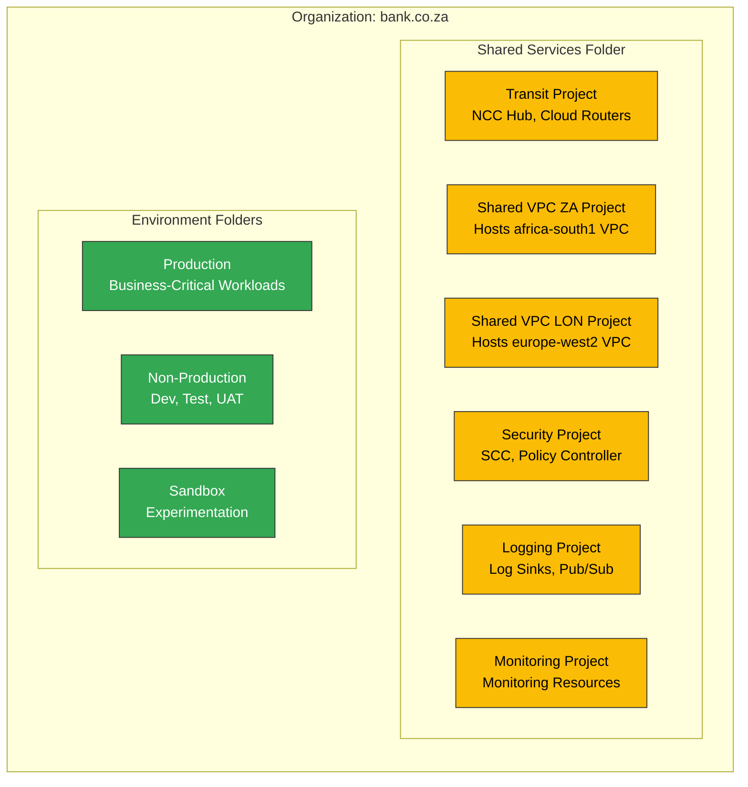

---

## 4. Identity and Access Management (IAM)

IAM strategy secures cloud resources through proper identity federation, authentication, and authorization.

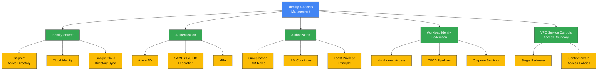

### Identity Flow Diagram

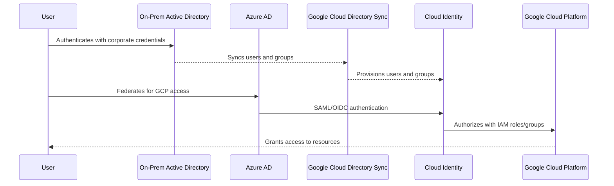

---

## 5. Networking and Connectivity

### 5.1 Network Topology

The network architecture follows a hub-and-spoke model with Global Network Connectivity Center.

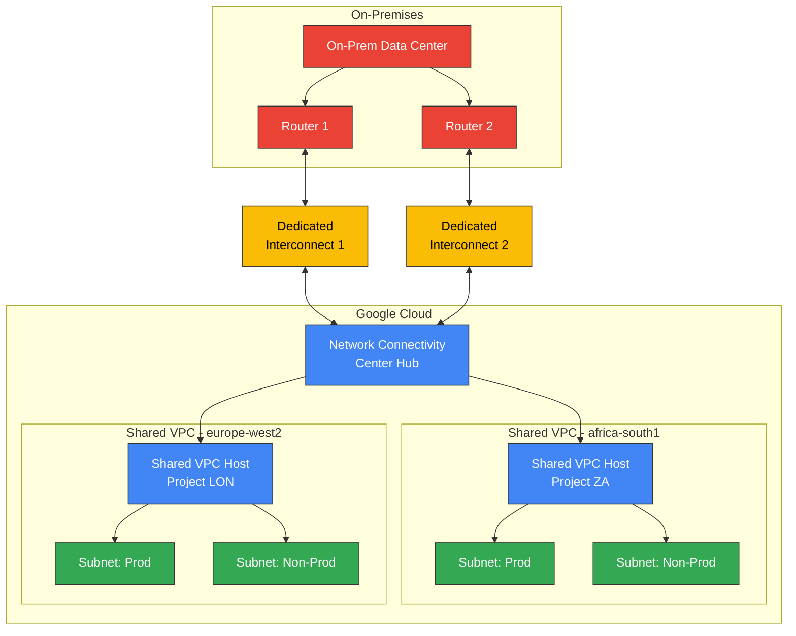

### 5.2 IP Addressing & BGP

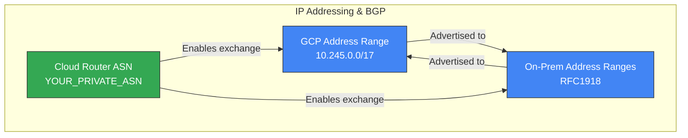

### 5.3 Internet Egress

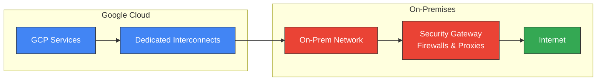

### 5.4 Access to Google APIs

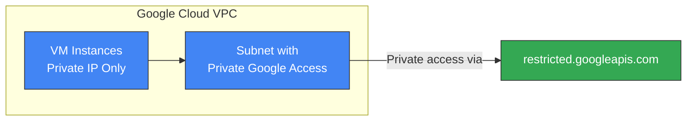

### 5.5 Firewall Architecture

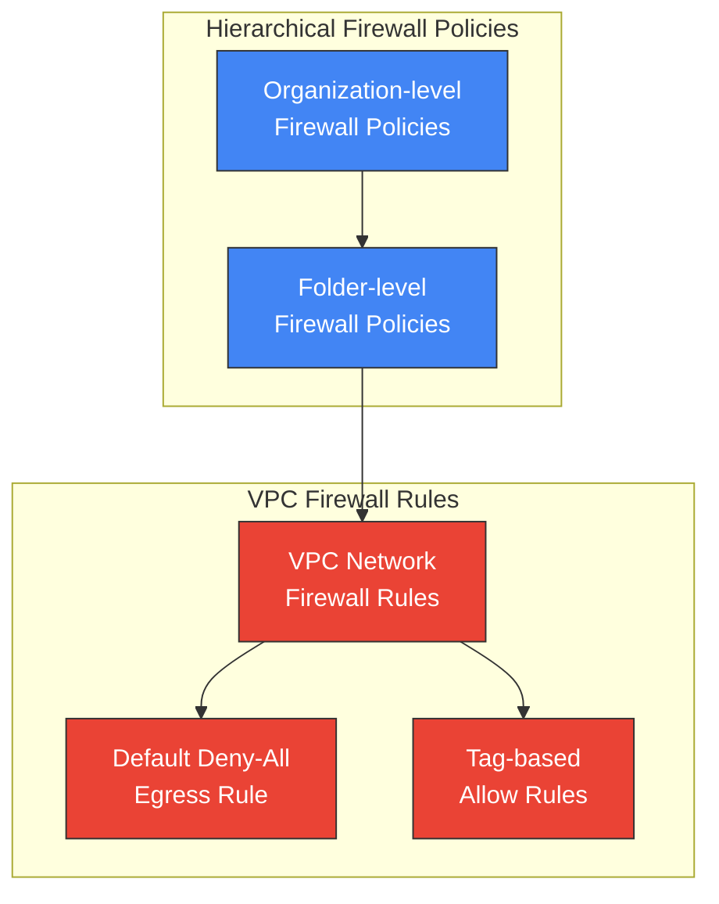

### 5.6 DNS Architecture

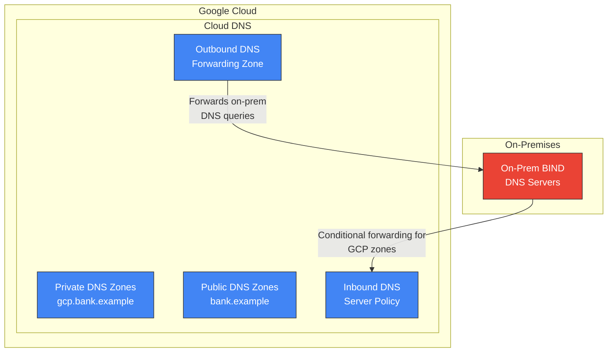

---

## 6. Security and Compliance Controls

A comprehensive set of security controls protect data and workloads in the cloud.

```mermaid
graph TD
    A[Security & Compliance<br>Controls] --> B[Data Residency<br>& Encryption]
    A --> C[Workload Isolation]
    A --> D[Monitoring &<br>Threat Detection]
    A --> E[Policy Enforcement]
    A --> F[Logging & SIEM<br>Integration]
    
    B --> B1[Primary: africa-south1]
    B --> B2[DR: europe-west2]
    B --> B3[CMEK with Cloud KMS]
    
    C --> C1[VPC Service Controls]
    C --> C2[Hierarchical Firewalls]
    
    D --> D1[Security Command<br>Center - Standard Tier]
    
    E --> E1[Policy Controller]
    E --> E2[Anthos Config<br>Management]
    
    F --> F1[Cloud Logging]
    F --> F2[Pub/Sub]
    F --> F3[Splunk (On-Prem)]

    classDef primary fill:#4285F4,stroke:#333,stroke-width:1px,color:white;
    classDef secondary fill:#34A853,stroke:#333,stroke-width:1px,color:white;
    classDef tertiary fill:#FBBC05,stroke:#333,stroke-width:1px,color:black;
    class A primary;
    class B,C,D,E,F secondary;
    class B1,B2,B3,C1,C2,D1,E1,E2,F1,F2,F3 tertiary;
```

### Security Architecture Diagram

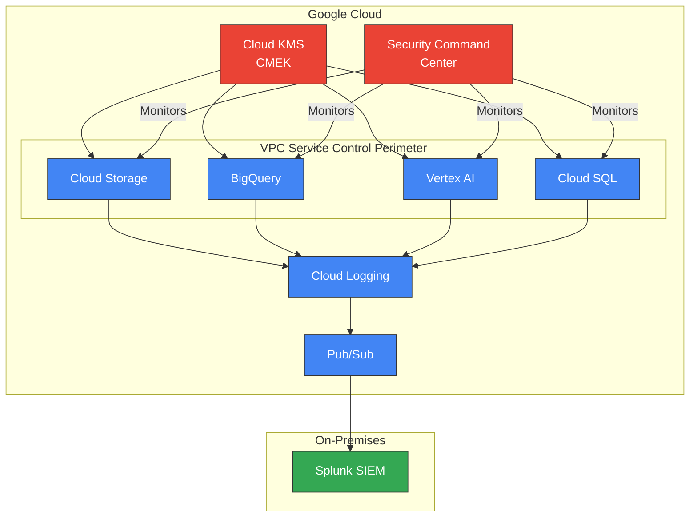

---

## 7. AI/ML & Data-Analytics Platform Architecture

The landing zone supports advanced AI/ML and data analytics workloads.

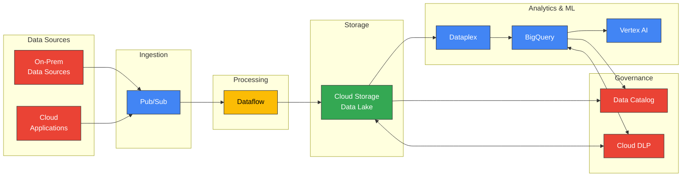

---

## 8. Hybrid & Multi-Cloud Integration

The architecture supports hybrid and multi-cloud scenarios for seamless workload and data management.

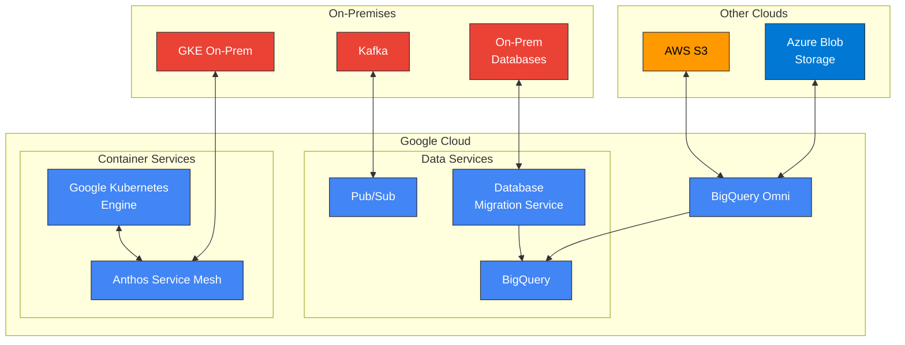

---

## 9. Operations & Observability

A comprehensive operations and observability stack ensures system health and performance.

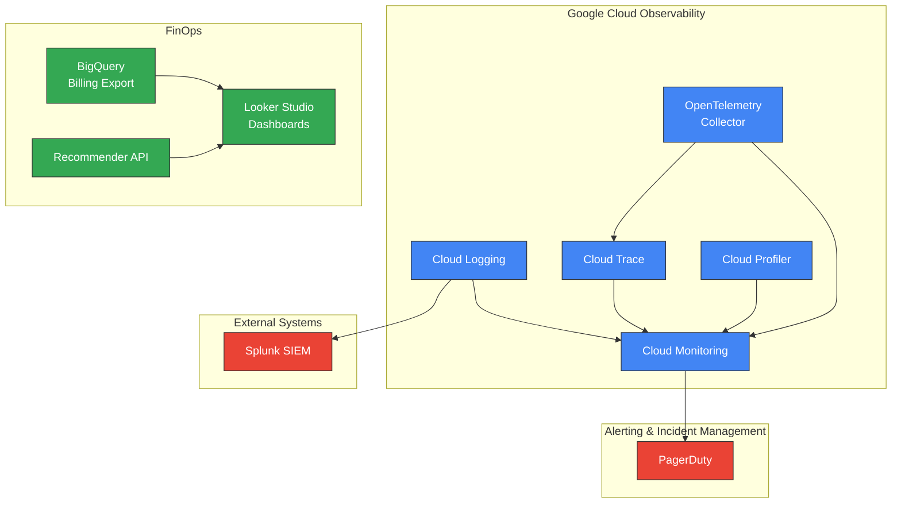

---

## 10. Infrastructure as Code (IaC) & Automation

Automation is a cornerstone of this architecture, with Terraform as the primary IaC tool.

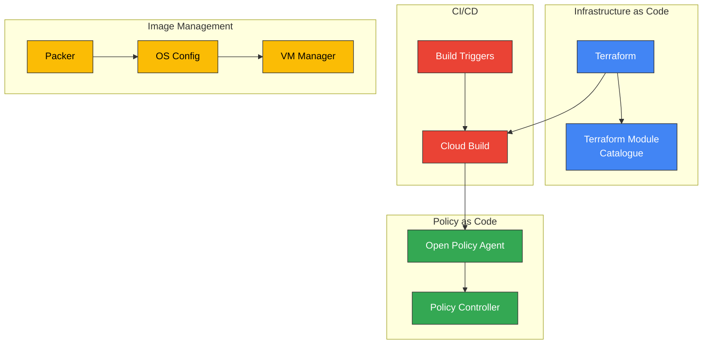

### CI/CD Pipeline Flow

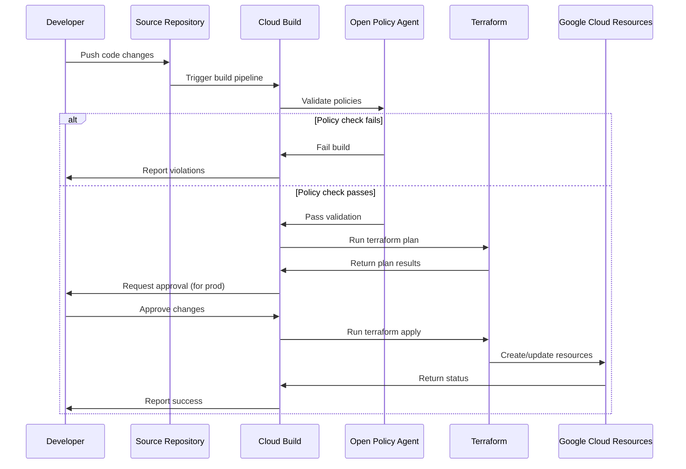

---

## 11. Terraform Strategy

The effective use of Terraform is critical for successfully implementing and maintaining the landing zone.

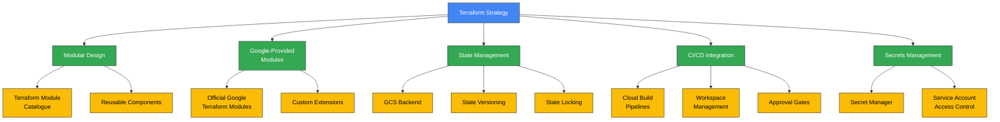

### Terraform Module Structure

```mermaid
graph TD
    subgraph "Terraform Module Catalogue"
        ORG_MODULE[Organization<br>Module]
        FOLDER_MODULE[Folder<br>Module]
        PROJECT_MODULE[Project Factory<br>Module]
        IAM_MODULE[IAM<br>Module]
        
        NETWORK_MODULE[Network<br>Module]
        VPC_SC_MODULE[VPC Service Controls<br>Module]
        GKE_MODULE[GKE<br>Module]
        KMS_MODULE[KMS<br>Module]
        
        LOGGING_MODULE[Logging & Monitoring<br>Module]
        DATAPROC_MODULE[Dataproc<br>Module]
        BQ_MODULE[BigQuery<br>Module]
        VERTEX_MODULE[Vertex AI<br>Module]
    end
    
    subgraph "Environment Configurations"
        PROD_CONFIG[Production<br>Configuration]
        NONPROD_CONFIG[Non-Production<br>Configuration]
    end
    
    PROD_CONFIG --> ORG_MODULE
    PROD_CONFIG --> FOLDER_MODULE
    PROD_CONFIG --> PROJECT_MODULE
    PROD_CONFIG --> IAM_MODULE
    PROD_CONFIG --> NETWORK_MODULE
    PROD_CONFIG --> VPC_SC_MODULE
    PROD_CONFIG --> GKE_MODULE
    PROD_CONFIG --> KMS_MODULE
    PROD_CONFIG --> LOGGING_MODULE
    PROD_CONFIG --> DATAPROC_MODULE
    PROD_CONFIG --> BQ_MODULE
    PROD_CONFIG --> VERTEX_MODULE
    
    NONPROD_CONFIG --> ORG_MODULE
    NONPROD_CONFIG --> FOLDER_MODULE
    NONPROD_CONFIG --> PROJECT_MODULE
    NONPROD_CONFIG --> IAM_MODULE
    NONPROD_CONFIG --> NETWORK_MODULE
    NONPROD_CONFIG --> VPC_SC_MODULE
    NONPROD_CONFIG --> GKE_MODULE
    NONPROD_CONFIG --> KMS_MODULE
    NONPROD_CONFIG --> LOGGING_MODULE
    NONPROD_CONFIG --> DATAPROC_MODULE
    NONPROD_CONFIG --> BQ_MODULE
    NONPROD_CONFIG --> VERTEX_MODULE
    
    classDef module fill:#4285F4,stroke:#333,stroke-width:1px,color:white;
    classDef config fill:#34A853,stroke:#333,stroke-width:1px,color:white;
    
    class ORG_MODULE,FOLDER_MODULE,PROJECT_MODULE,IAM_MODULE,NETWORK_MODULE,VPC_SC_MODULE,GKE_MODULE,KMS_MODULE,LOGGING_MODULE,DATAPROC_MODULE,BQ_MODULE,VERTEX_MODULE module;
    class PROD_CONFIG,NONPROD_CONFIG config;
```

## 12. End-to-End Architecture Overview

This comprehensive diagram brings together the key components of the Google Cloud Landing Zone architecture for the banking group.

```mermaid
graph TD
    subgraph "On-Premises"
        AD[Active Directory]
        AZURE_AD[Azure AD]
        SPLUNK[Splunk SIEM]
        ONPREM_DC[On-Prem Data Center]
        SECURITY_GW[Security Gateways]
    end
    
    subgraph "Google Cloud Organization"
        subgraph "Shared Services"
            NCC[Network Connectivity<br>Center Hub]
            SHARED_VPC_ZA[Shared VPC<br>africa-south1]
            SHARED_VPC_LON[Shared VPC<br>europe-west2]
            CLOUD_DNS[Cloud DNS]
            SCC[Security Command<br>Center]
            KMS[Cloud KMS]
            POLICY_CTRL[Policy Controller]
        end
        
        subgraph "Production Environment"
            PROD_PROJECTS[Production<br>Projects]
        end
        
        subgraph "Non-Production Environment"
            NONPROD_PROJECTS[Non-Production<br>Projects]
        end
        
        subgraph "Data & AI Platform"
            GCS[Cloud Storage]
            PUBSUB[Pub/Sub]
            DATAFLOW[Dataflow]
            BQ[BigQuery]
            VERTEX[Vertex AI]
            DATAPLEX[Dataplex]
        end
        
        subgraph "Operations"
            LOGGING[Cloud Logging]
            MONITORING[Cloud Monitoring]
            TRACE[Cloud Trace]
            BILLING[Billing Export<br>to BigQuery]
        end
    end
    
    subgraph "Developer Tools"
        TERRAFORM[Terraform]
        CLOUDBUILD[Cloud Build]
    end
    
    %% Identity & Access
    AD -- "Directory Sync" --> CLOUD_IDENTITY[Cloud Identity]
    AZURE_AD -- "Federation" --> CLOUD_IDENTITY
    CLOUD_IDENTITY -- "IAM" --> SHARED_VPC_ZA
    CLOUD_IDENTITY -- "IAM" --> SHARED_VPC_LON
    CLOUD_IDENTITY -- "IAM" --> PROD_PROJECTS
    CLOUD_IDENTITY -- "IAM" --> NONPROD_PROJECTS
    
    %% Networking
    ONPREM_DC -- "Dedicated<br>Interconnects" --> NCC
    NCC -- "Spoke" --> SHARED_VPC_ZA
    NCC -- "Spoke" --> SHARED_VPC_LON
    SHARED_VPC_ZA -- "Hosts" --> PROD_PROJECTS
    SHARED_VPC_ZA -- "Hosts" --> NONPROD_PROJECTS
    SHARED_VPC_LON -- "DR" --> PROD_PROJECTS
    CLOUD_DNS -- "Private Zones" --> SHARED_VPC_ZA
    CLOUD_DNS -- "Private Zones" --> SHARED_VPC_LON
    
    %% Internet Egress
    SHARED_VPC_ZA -- "Internet Traffic" --> ONPREM_DC
    ONPREM_DC -- "Egress" --> SECURITY_GW
    
    %% Security
    SCC -- "Monitors" --> SHARED_VPC_ZA
    SCC -- "Monitors" --> SHARED_VPC_LON
    SCC -- "Monitors" --> PROD_PROJECTS
    SCC -- "Monitors" --> NONPROD_PROJECTS
    SCC -- "Monitors" --> GCS
    SCC -- "Monitors" --> BQ
    KMS -- "CMEK" --> GCS
    KMS -- "CMEK" --> BQ
    KMS -- "CMEK" --> VERTEX
    POLICY_CTRL -- "Enforces" --> PROD_PROJECTS
    POLICY_CTRL -- "Enforces" --> NONPROD_PROJECTS
    
    %% Data Flow
    PROD_PROJECTS -- "Data" --> GCS
    PROD_PROJECTS -- "Events" --> PUBSUB
    PUBSUB -- "Streams" --> DATAFLOW
    DATAFLOW -- "Processes" --> GCS
    GCS -- "Analytics" --> BQ
    BQ -- "ML" --> VERTEX
    DATAPLEX -- "Governs" --> GCS
    DATAPLEX -- "Governs" --> BQ
    
    %% Operations
    PROD_PROJECTS -- "Logs" --> LOGGING
    NONPROD_PROJECTS -- "Logs" --> LOGGING
    GCS -- "Logs" --> LOGGING
    BQ -- "Logs" --> LOGGING
    VERTEX -- "Logs" --> LOGGING
    LOGGING -- "Export" --> SPLUNK
    PROD_PROJECTS -- "Metrics" --> MONITORING
    NONPROD_PROJECTS -- "Metrics" --> MONITORING
    BILLING -- "Cost Data" --> BQ
    
    %% IaC
    TERRAFORM -- "Deploys" --> PROD_PROJECTS
    TERRAFORM -- "Deploys" --> NONPROD_PROJECTS
    TERRAFORM -- "Deploys" --> SHARED_VPC_ZA
    TERRAFORM -- "Deploys" --> SHARED_VPC_LON
    TERRAFORM -- "Deploys" --> NCC
    CLOUDBUILD -- "Runs" --> TERRAFORM
    
    classDef onprem fill:#EA4335,stroke:#333,stroke-width:1px,color:white;
    classDef shared fill:#4285F4,stroke:#333,stroke-width:1px,color:white;
    classDef env fill:#34A853,stroke:#333,stroke-width:1px,color:white;
    classDef data fill:#FBBC05,stroke:#333,stroke-width:1px,color:black;
    classDef ops fill:#4285F4,stroke:#333,stroke-width:1px,color:white;
    classDef dev fill:#34A853,stroke:#333,stroke-width:1px,color:white;
    classDef identity fill:#673AB7,stroke:#333,stroke-width:1px,color:white;
    
    class AD,AZURE_AD,SPLUNK,ONPREM_DC,SECURITY_GW onprem;
    class NCC,SHARED_VPC_ZA,SHARED_VPC_LON,CLOUD_DNS,SCC,KMS,POLICY_CTRL shared;
    class PROD_PROJECTS,NONPROD_PROJECTS env;
    class GCS,PUBSUB,DATAFLOW,BQ,VERTEX,DATAPLEX data;
    class LOGGING,MONITORING,TRACE,BILLING ops;
    class TERRAFORM,CLOUDBUILD dev;
    class CLOUD_IDENTITY identity;
```

## 13. Conclusion

This comprehensive architecture document with integrated Mermaid diagrams provides a clear visualization of the Google Cloud Landing Zone for the Banking Group. The architecture establishes a secure, compliant, scalable, and automated foundation that supports AI/ML and data-analytics workloads within a hybrid cloud context.

Key architectural components are visualized to ensure all stakeholders understand:
- The resource hierarchy organization
- Identity and access management flows
- Network topology and connectivity
- Security and compliance controls
- Data and AI platform architecture
- Hybrid and multi-cloud integration approaches
- Operations and observability setup
- Infrastructure as Code and automation pipelines

By leveraging Terraform as the primary IaC tool, with a modular approach and integration with CI/CD pipelines, the bank can ensure consistent, reliable, and auditable infrastructure deployments that meet regulatory requirements while enabling innovation and business agility.
