# Google Cloud Landing Zone Architecture - Banking Group
*Prepared by: Cloud Architecture Team*  
*Date: May 21, 2025*

---

## 1. Executive Summary
This document details a **comprehensive, enterprise-scale Google Cloud Landing Zone** for a South African banking group. The architecture is designed to establish a secure, compliant, scalable, and automated foundation that supports AI/ML and data-analytics workloads within a hybrid cloud context, ensuring seamless integration with on-premises systems and adherence to stringent regulatory standards (SARB, POPIA).

Key features:
* **Secure-by-default approach** leveraging least-privilege IAM, VPC Service Controls, CMEK via Cloud KMS, and Security Command Center Standard Tier.
* **Well-defined resource hierarchy** with folders and projects organized by environment and function.
* **Hub-and-spoke network architecture** with dedicated interconnects from Johannesburg and resilient connectivity to on-premises infrastructure.
* **Policy-driven governance** with Terraform IaC and Cloud Build CI/CD pipelines.
* **Comprehensive AI/ML platform** using BigQuery, Vertex AI, and Dataplex.
* **Centralized operations** with Cloud Monitoring, Cloud Logging, and Splunk SIEM integration.

---

## 2. Guiding Principles & Compliance

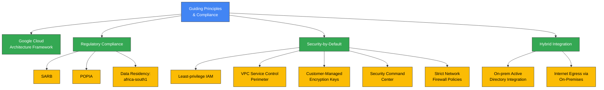

* **Google Cloud Architecture Framework**: Aligned with Google's best practices for designing and operating cloud workloads.
* **Regulatory Compliance**: Designed to meet South African Reserve Bank (SARB) and Protection of Personal Information Act (POPIA) requirements, with `africa-south1` as the primary region for data residency.
* **Security-by-Default**: Implementing comprehensive security controls from the ground up including least-privilege IAM, VPC Service Controls, CMEK via Cloud KMS, and strict network policies.
* **Hybrid Integration**: Seamless integration with on-prem Active Directory and routing of internet egress via on-premises infrastructure.

---

## 3. Organization & Resource Hierarchy

```mermaid
graph TD
    ORG[Organization: bank.example] --> FOLDER_SHARED[Folder: 00-Shared-Services]
    ORG --> FOLDER_PROD[Folder: 10-Prod-Environments]
    ORG --> FOLDER_NONPROD[Folder: 20-Non-Prod-Environments]
    ORG --> FOLDER_SANDBOX[Folder: 30-Sandbox-Environments]
    
    FOLDER_SHARED --> PRJ_TRANSIT[Project: Transit-Connectivity]
    FOLDER_SHARED --> PRJ_VPC_ZA[Project: Shared-VPC-Host-ZA]
    FOLDER_SHARED --> PRJ_VPC_LON[Project: Shared-VPC-Host-LON]
    FOLDER_SHARED --> PRJ_SEC[Project: Security-Tools]
    FOLDER_SHARED --> PRJ_LOG[Project: Logging]
    FOLDER_SHARED --> PRJ_MON[Project: Monitoring]
    
    FOLDER_PROD --> BU_RETAIL_PROD[Folder: bu-retail-prod]
    BU_RETAIL_PROD --> PROJ_RETAIL_PROD[Project: Workload-Retail-Prod]
    
    FOLDER_NONPROD --> BU_RETAIL_DEV[Folder: bu-retail-dev]
    BU_RETAIL_DEV --> PROJ_RETAIL_DEV[Project: Workload-Retail-Dev]
    
    FOLDER_NONPROD --> BU_RETAIL_UAT[Folder: bu-retail-uat]
    BU_RETAIL_UAT --> PROJ_RETAIL_UAT[Project: Workload-Retail-UAT]
    
    FOLDER_SANDBOX --> PROJ_SANDBOX[Project: Sandbox-Projects]
    
    classDef org fill:#4285F4,stroke:#333,stroke-width:1px,color:white;
    classDef folder fill:#34A853,stroke:#333,stroke-width:1px,color:white;
    classDef project fill:#FBBC05,stroke:#333,stroke-width:1px,color:black;
    class ORG org;
    class FOLDER_SHARED,FOLDER_PROD,FOLDER_NONPROD,FOLDER_SANDBOX,BU_RETAIL_PROD,BU_RETAIL_DEV,BU_RETAIL_UAT folder;
    class PRJ_TRANSIT,PRJ_VPC_ZA,PRJ_VPC_LON,PRJ_SEC,PRJ_LOG,PRJ_MON,PROJ_RETAIL_PROD,PROJ_RETAIL_DEV,PROJ_RETAIL_UAT,PROJ_SANDBOX project;
```

The resource hierarchy provides structure for governance, cost management, and operational efficiency:

* **Organization**: `bank.example` (Top-level node)
* **Folders**: Provide isolation and policy inheritance
  * **Shared Services Folder**: Hosts centralized network, security, logging, and monitoring projects
  * **Production Environments Folder**: Contains all production workloads by business unit
  * **Non-Production Environments Folder**: Houses development, testing, and UAT environments
  * **Sandbox Environments Folder**: Provides isolated environments for experimentation
* **Projects**: Fundamental unit for resource deployment, billing, and IAM
  * Each project isolates resources for a specific application, environment, or service

---

## 4. Identity & Access Management

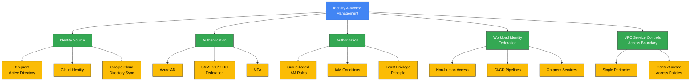

* **Identity Source**: On-prem Active Directory remains authoritative. Cloud Identity and Google Cloud Directory Sync (GCDS) are used for identity synchronization.
* **Authentication**: SAML 2.0 / OIDC federation with Azure AD for Multi-Factor Authentication (MFA) and conditional access.
* **Authorization**: Least-privilege principle enforced via group-based IAM roles and IAM conditions.
* **Workload Identity Federation**: Used for non-human access (CI/CD pipelines, on-prem services) to avoid service account keys.
* **Access Boundary**: A single VPC Service Controls perimeter protects critical Google Cloud services with context-aware access policies.
* **Managed Microsoft AD**: Optional deployment for AD-dependent workloads.

---

## 5. Networking & Connectivity

### 5.1 Network Topology

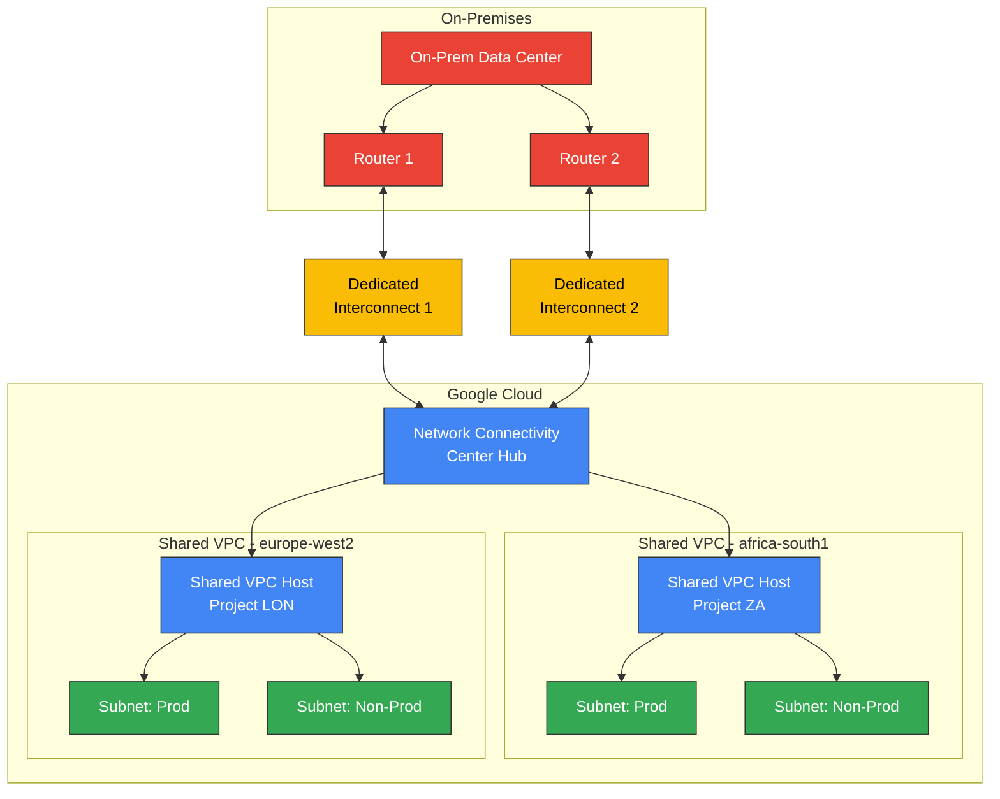

* **Hub-and-Spoke Model**: Uses a Global Network Connectivity Center (NCC) Hub.
* **On-Prem Connectivity**: Dual 10Gbps Dedicated Interconnects from Johannesburg co-location, connecting as VLAN attachments to the NCC Hub.
* **GCP VPC Spokes**: Regional Shared VPCs in `africa-south1` (Primary) and `europe-west2` (DR) attached as spokes to the Global NCC Hub.
* **IP Addressing**: GCP Address Range: `10.245.0.0/17` (advertised to on-prem) with Standard RFC1918 ranges from on-prem.
* **Internet Egress**: All internet-bound traffic from GCP services is routed via the Interconnects to the on-premises network.
* **Private Google Access**: Configured for subnets using `restricted.googleapis.com`.
* **Firewall Architecture**: Hierarchical Firewall Policies applied at Organization/Folder levels with default deny-all egress from VPCs.

### 5.2 DNS Architecture

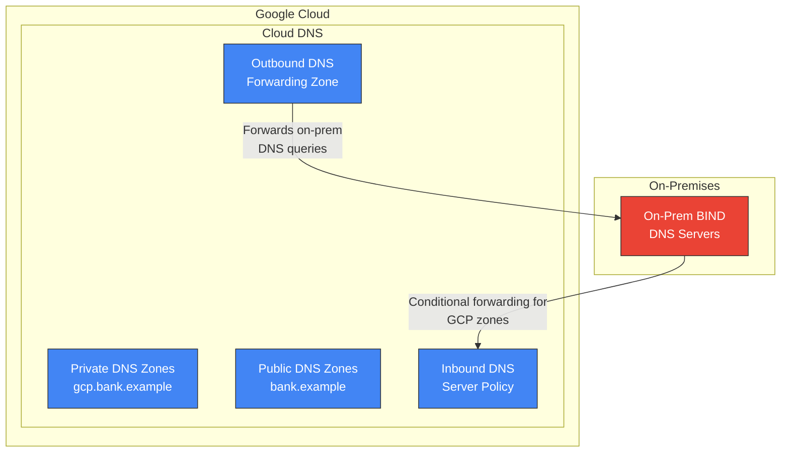

* **Split-Horizon DNS**: Different DNS views for internal and external resolution.
* **GCP Private Zones**: Cloud DNS private zones (e.g., `gcp.bank.example`) associated with regional Shared VPCs.
* **On-Prem to GCP Resolution**: On-prem BIND servers use conditional forwarding via Cloud DNS inbound server policies.
* **GCP to On-Prem Resolution**: Cloud DNS outbound server policies/forwarding zones point to on-prem BIND servers.
* **Public DNS**: Managed via Cloud DNS public zones (e.g., for `bank.example`).

---

## 6. Security & Compliance Controls

```mermaid
graph TD
    A[Security & Compliance<br>Controls] --> B[Data Residency<br>& Encryption]
    A --> C[Workload Isolation]
    A --> D[Monitoring &<br>Threat Detection]
    A --> E[Policy Enforcement]
    A --> F[Logging & SIEM<br>Integration]
    
    B --> B1[Primary: africa-south1]
    B --> B2[DR: europe-west2]
    B --> B3[CMEK with Cloud KMS]
    
    C --> C1[VPC Service Controls]
    C --> C2[Hierarchical Firewalls]
    
    D --> D1[Security Command<br>Center - Standard Tier]
    
    E --> E1[Policy Controller]
    E --> E2[Anthos Config<br>Management]
    
    F --> F1[Cloud Logging]
    F --> F2[Pub/Sub]
    F --> F3[Splunk (On-Prem)]

    classDef primary fill:#4285F4,stroke:#333,stroke-width:1px,color:white;
    classDef secondary fill:#34A853,stroke:#333,stroke-width:1px,color:white;
    classDef tertiary fill:#FBBC05,stroke:#333,stroke-width:1px,color:black;
    class A primary;
    class B,C,D,E,F secondary;
    class B1,B2,B3,C1,C2,D1,E1,E2,F1,F2,F3 tertiary;
```

* **Data Residency**: Primary region is `africa-south1` (Johannesburg), DR region is `europe-west2` (London).
* **Encryption**: Default Customer-Managed Encryption Keys (CMEK) with Cloud KMS for critical services.
* **Workload Isolation**: A single comprehensive VPC Service Controls perimeter protects critical services, with hierarchical firewalls enforcing network segmentation.
* **Monitoring & Threat Detection**: Security Command Center (SCC) Standard Tier provides centralized visibility into security posture.
* **Policy Enforcement**: Policy Controller (Anthos Config Management) enables policy-as-code.
* **Logging & SIEM Integration**: Cloud Logging exports all critical audit, platform, and application logs via Pub/Sub to on-prem Splunk.

---

## 7. AI/ML & Data-Analytics Platform

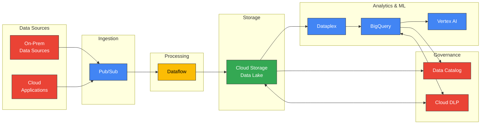

* **Data Lifecycle Overview**:
  * **Ingestion**: Pub/Sub for real-time event streaming, potentially integrating with on-prem Kafka.
  * **Processing**: Dataflow for scalable batch and stream data processing.
  * **Storage**: Google Cloud Storage (GCS) for raw data, staging, and processed data (data lake).
  * **Lakehouse & Warehousing**: Dataplex for managing and governing data across GCS and BigQuery. BigQuery as the serverless data warehouse for analytics and ML.
  * **AI/ML Compute**: Vertex AI for custom model training, serving, and pre-built ML APIs.
  * **Governance**: Data Catalog for metadata management and discovery, Cloud Data Loss Prevention (DLP) for protecting sensitive data.

* **Security Integration**:
  * All AI/ML services operate within the established VPC Service Control perimeter.
  * CMEK encryption is used for data stored in GCS, BigQuery, and Vertex AI managed datasets.

---

## 8. Hybrid & Multi-Cloud Integration

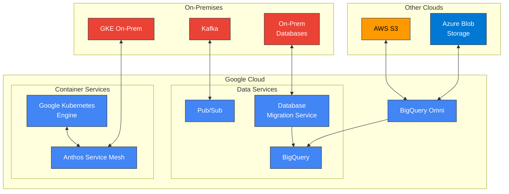

* **Anthos**: Strategic platform for hybrid container workloads and service management.
  * **GKE on-prem**: Extends Google Kubernetes Engine to on-premises environments.
  * **Anthos Service Mesh**: Provides uniform observability, security, and control for microservices.
* **Database Migration Service (DMS)**: Facilitates migration of on-premises databases to Google Cloud.
* **BigQuery Omni**: Allows querying data residing in other clouds without moving the data.
* **Pub/Sub**: Acts as a global, scalable messaging service capable of bridging to on-prem systems like Kafka.

---

## 9. Operations & Observability

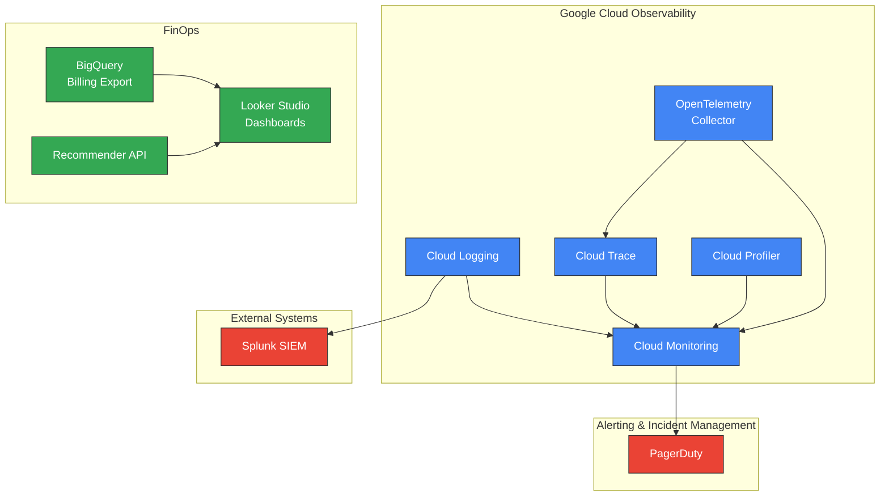

* **Core Tooling**:
  * **Cloud Logging**: Centralized log collection and analysis.
  * **Cloud Monitoring**: Metrics collection, dashboards, and alerting for GCP resources and applications.
* **Alerting**: PagerDuty integration for notifying on-call teams of critical issues.
* **Application Performance Management (APM)**:
  * **Cloud Trace**: Distributed tracing for understanding request latency.
  * **Cloud Profiler**: Continuous CPU and heap profiling to identify performance bottlenecks.
  * **OpenTelemetry Collector**: For collecting traces and metrics using open standards.
* **Log Management**: All critical logs exported to on-prem Splunk for long-term storage and analysis.
* **FinOps**:
  * **BigQuery Billing Export**: Granular billing data exported to BigQuery for analysis.
  * **Looker Studio Dashboards**: Visualization of cost data.
  * **Recommender API**: Provides cost optimization recommendations.

---

## 10. Infrastructure as Code & Automation

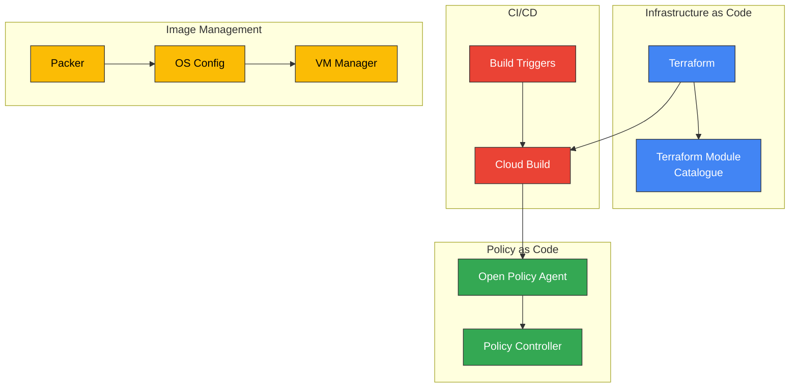

* **IaC Core**: Terraform as the primary tool for defining and provisioning all Google Cloud infrastructure.
* **CI/CD**: Cloud Build for continuous integration and continuous delivery pipelines.
* **Policy as Code**: Policy Controller defines and enforces organizational policies on GCP resources and Kubernetes clusters.
* **Golden Images & Patching**:
  * **Packer**: For creating hardened, standardized VM images.
  * **OS Config**: For managing OS configurations and patch deployment.
  * **VM Manager**: Suite of tools for managing OS environments on Compute Engine.

### CI/CD Pipeline Flow

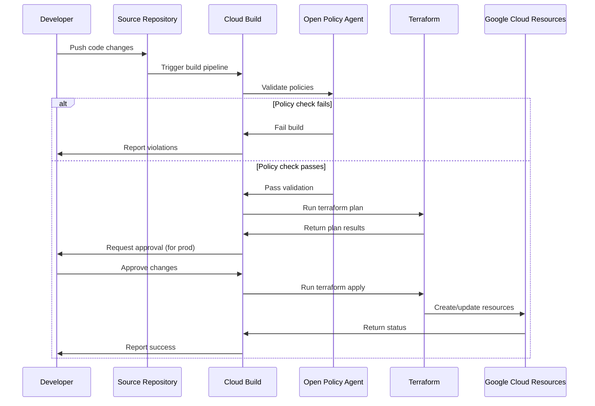

---

## 11. Terraform Strategy

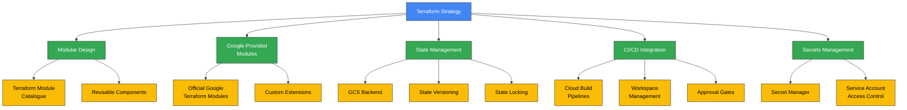

* **Modular Design**: A Terraform Module Catalogue will be developed, containing reusable modules for common infrastructure patterns.
* **Google-Provided Modules**: Where appropriate, Google's official Terraform modules will be utilized and potentially extended.
* **State Management**: Terraform state will be stored securely in Google Cloud Storage buckets with versioning and object locking.
* **CI/CD Integration**: Cloud Build pipelines will automate terraform plan and apply stages with workspaces for different environments.
* **Secrets Management**: Sensitive data will be managed using Google Cloud Secret Manager.

---

## 12. Implementation Roadmap

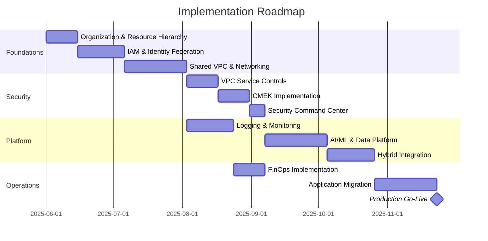

The implementation of the Google Cloud Landing Zone will follow a phased approach:

| Phase | Timeline | Key Activities |
|-------|----------|----------------|
| 1. Foundations | Months 1-2 | - Organization setup<br>- Folder/project structure<br>- IAM federation<br>- Shared VPC deployment<br>- Interconnect provisioning |
| 2. Security | Month 3 | - VPC Service Controls<br>- CMEK implementation<br>- Security monitoring<br>- Logging exports |
| 3. Platform | Months 4-5 | - Monitoring & observability<br>- AI/ML platform setup<br>- Hybrid connectivity<br>- Policy enforcement |
| 4. Operations | Months 6-7 | - FinOps dashboards<br>- Application migration<br>- Production readiness<br>- Knowledge transfer |

---

## 13. End-to-End Architecture Overview

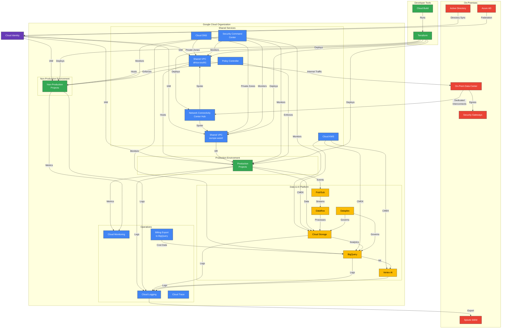

This comprehensive diagram brings together the key components of the Google Cloud Landing Zone architecture for the banking group, illustrating how all the components interact within a secure, compliant, and well-governed environment.

---

## 14. Key Design Decisions Summary

| Area | Decision | Rationale |
|------|----------|-----------|
| **Data Residency** | Primary: `africa-south1`<br>DR: `europe-west2` | Aligns with SARB & POPIA requirements while providing robust disaster recovery capabilities |
| **IAM Strategy** | On-prem AD + Cloud Identity federation via GCDS | Maintains existing identity source while leveraging cloud-native controls |
| **Network Design** | Hub-and-spoke with NCC and Shared VPCs | Centralized network control while allowing service project flexibility |
| **Internet Egress** | Via on-premises security controls | Leverages existing security investments and maintains uniform policy enforcement |
| **Security** | VPC-SC + CMEK + SCC Standard Tier | Defense-in-depth approach with multiple security layers |
| **AI/ML Platform** | Vertex AI + BigQuery + Dataplex | Comprehensive, managed platform with strong data governance capabilities |
| **Hybrid Strategy** | Anthos + Dedicated Interconnect | Consistent container platform across environments with high-bandwidth connectivity |
| **Operations** | Cloud Logging/Monitoring + Splunk integration | Combines cloud-native observability with enterprise SIEM integration |
| **Automation** | Terraform + Cloud Build + Policy Controller | Infrastructure as code with built-in policy guardrails and CI/CD integration |

---

## 15. Conclusion

This Google Cloud Landing Zone architecture provides a robust, secure, and scalable foundation for the banking group's cloud journey. By leveraging a well-defined resource hierarchy, centralized IAM, a resilient hybrid network, comprehensive security controls, and extensive automation through Terraform and Cloud Build, the bank can confidently deploy AI/ML and data analytics workloads while adhering to strict compliance and security mandates.

The emphasis on modularity, policy-as-code, and a strong FinOps practice will ensure the landing zone remains adaptable, governable, and cost-effective as the bank's cloud adoption matures. The architecture follows Google Cloud best practices and industry standards, providing a future-proof foundation that can evolve with the organization's needs.

---

## Appendices

### Appendix A: Terraform Module Catalogue

```mermaid
graph TD
    subgraph "Terraform Module Catalogue"
        ORG_MODULE[Organization<br>Module]
        FOLDER_MODULE[Folder<br>Module]
        PROJECT_MODULE[Project Factory<br>Module]
        IAM_MODULE[IAM<br>Module]
        
        NETWORK_MODULE[Network<br>Module]
        VPC_SC_MODULE[VPC Service Controls<br>Module]
        GKE_MODULE[GKE<br>Module]
        KMS_MODULE[KMS<br>Module]
        
        LOGGING_MODULE[Logging & Monitoring<br>Module]
        DATAPROC_MODULE[Dataproc<br>Module]
        BQ_MODULE[BigQuery<br>Module]
        VERTEX_MODULE[Vertex AI<br>Module]
    end
    
    subgraph "Environment Configurations"
        PROD_CONFIG[Production<br>Configuration]
        NONPROD_CONFIG[Non-Production<br>Configuration]
    end
    
    PROD_CONFIG --> ORG_MODULE
    PROD_CONFIG --> FOLDER_MODULE
    PROD_CONFIG --> PROJECT_MODULE
    PROD_CONFIG --> IAM_MODULE
    PROD_CONFIG --> NETWORK_MODULE
    PROD_CONFIG --> VPC_SC_MODULE
    PROD_CONFIG --> GKE_MODULE
    PROD_CONFIG --> KMS_MODULE
    PROD_CONFIG --> LOGGING_MODULE
    PROD_CONFIG --> DATAPROC_MODULE
    PROD_CONFIG --> BQ_MODULE
    PROD_CONFIG --> VERTEX_MODULE
    
    NONPROD_CONFIG --> ORG_MODULE
    NONPROD_CONFIG --> FOLDER_MODULE
    NONPROD_CONFIG --> PROJECT_MODULE
    NONPROD_CONFIG --> IAM_MODULE
    NONPROD_CONFIG --> NETWORK_MODULE
    NONPROD_CONFIG --> VPC_SC_MODULE
    NONPROD_CONFIG --> GKE_MODULE
    NONPROD_CONFIG --> KMS_MODULE
    NONPROD_CONFIG --> LOGGING_MODULE
    NONPROD_CONFIG --> DATAPROC_MODULE
    NONPROD_CONFIG --> BQ_MODULE
    NONPROD_CONFIG --> VERTEX_MODULE
    
    classDef module fill:#4285F4,stroke:#333,stroke-width:1px,color:white;
    classDef config fill:#34A853,stroke:#333,stroke-width:1px,color:white;
    
    class ORG_MODULE,FOLDER_MODULE,PROJECT_MODULE,IAM_MODULE,NETWORK_MODULE,VPC_SC_MODULE,GKE_MODULE,KMS_MODULE,LOGGING_MODULE,DATAPROC_MODULE,BQ_MODULE,VERTEX_MODULE module;
    class PROD_CONFIG,NONPROD_CONFIG config;
```

### Appendix B: Regulatory Control Mapping

| Regulatory Requirement | GCP Control Implementation |
|------------------------|----------------------------|
| **POPIA Section 19 - Security Safeguards** | - VPC Service Controls<br>- CMEK via Cloud KMS<br>- IAM & Organization Policies<br>- Cloud Audit Logs |
| **POPIA Section 20 - Information Processing** | - Data Loss Prevention (DLP)<br>- Dataplex Governance<br>- Data Catalog Tags |
| **POPIA Section 21 - Commissioned Processing** | - IAM Least Privilege<br>- Access Transparency<br>- VPC-SC Access Levels |
| **SARB G5/2018 - Cloud Computing** | - Dedicated Interconnect<br>- Private Google Access<br>- Regional Isolation (africa-south1)<br>- CMEK |
| **SARB G4/2022 - Cyber Resilience** | - Security Command Center<br>- Cloud IDS<br>- DLP Scanning<br>- Splunk Integration |
| **PCI-DSS v4.0** | - Hierarchical Firewall Policies<br>- IAM & VPC-SC<br>- Cloud KMS<br>- Security Command Center |

---

> **Document Version**  
> Version 1.0 - Initial Landing Zone Architecture (May 21, 2025)  
> Based on Google Cloud Architecture Framework (2025 Edition)